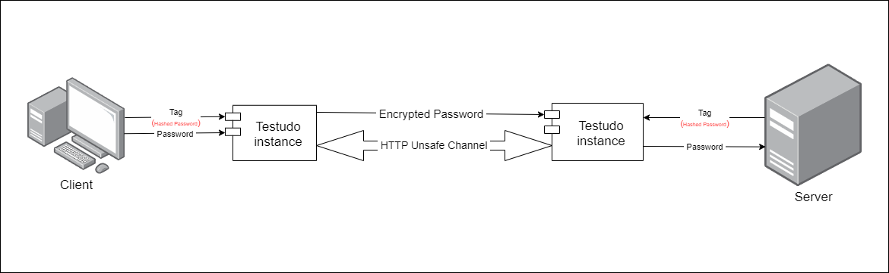

# What is Testudo

Encryption Libraries for Password Transfer in Web-Based Systems on an Unsafe Network/Protocol (like HTTP)

# Architecture



# Manual

- Hash password
- Pass hashed value and password value to Testudo class instance.
- Send encrypted value to server
- Pass recieved value and hashed password stored on server-side to Testudo class instance
- Use restroed value to Authenticate

## Javascript

```js
// on client-side
let encrypted = testudo().form(password, hashed_password)

// on server-side
let decrypted = testudo().unform(encrypted, testudo().getSeed(hashed_password, password))
```

## Csharp

```csharp
// on client-side
string encrypted = testudo.form(password, hashed_password);

// on server-side
string decrypted = testudo.unform(encrypted, testudo.getSeed(hashed_password, password));
```

## Php

```php
// on client-side
$encrypted = $testudo->form($password, $hashed_password);

// on server-side
$decrypted = $testudo->unform($encrypted, $testudo->getSeed($hashed_password, $password));
```

## Python

```python
# on client-side
encrypted = Testudo().form(password, hashed_password)

# on server-side
decrypted = Testudo().unform(encrypted, Testudo().getSeed(hashed_password, password))
```
